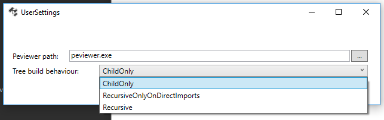
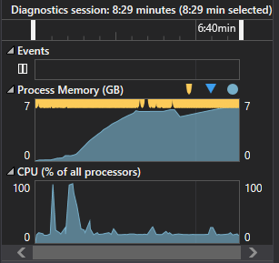

# Dependencies - An open-source modern Dependency Walker

### [Download here](https://github.com/lucasg/Dependencies/releases/download/v1.9/Dependencies_x64_Release.zip)

NB : due to [limitations on /clr compilation](https://msdn.microsoft.com/en-us/library/ffkc918h.aspx), `Dependencies` needs [Visual C++  Redistributable](https://support.microsoft.com/en-us/help/2977003/the-latest-supported-visual-c-downloads) installed to run properly.

## Overview
`Dependencies` is a rewrite of the legacy software [Dependency Walker](http://www.dependencywalker.com/) which was shipped along Windows SDKs, but whose development stopped around 2006.
`Dependencies` can help Windows developers troubleshooting their dll load dependencies issues.

## Releases
* [v1.9](https://github.com/lucasg/Dependencies/releases/download/v1.9/Dependencies_x64_Release.zip) :
	* Display imports and exports the way Depends.exe does.
	* Added user customization for search folders and working directory
	* Added LLVM demangler to availables symbol demangling
	* Fixed Wow64 FsRedirection bugs
	* F5 can now refresh the analysis
	* Added CLR assembly dependencies enumeration
	* Added a packaging option without Peview.exe (which triggers some AV).
* [v1.8](https://github.com/lucasg/Dependencies/releases/download/v1.8/Dependencies_x64_Release.zip) :
	* Add x86/x64 variants for Dependencies
* [v1.7](https://github.com/lucasg/Dependencies/releases/download/v1.7/Dependencies.zip) :
	* Add CLI tool "dependencies.exe"
* [v1.6](https://github.com/lucasg/Dependencies/releases/download/v1.6/Dependencies.zip) :
	* Add appx packaging
* [v1.5](https://github.com/lucasg/Dependencies/releases/download/v1.5/Dependencies.zip) :
	* Support of Sxs parsing
	* Support of api set schema parsing
	* API and Modules list can be filtered
* [v1.0](https://github.com/lucasg/Dependencies/releases/download/v1.0/Dependencies.zip) -- Initial release

## Installation and Usage

`Dependencies` is currently shipped as a binary (no installer present). Just click on one of the release numbers above (probably the latest), download and uncompress the archive and run DependenciesGui.exe.
Since the binary is not signed, `SmartScreen` might scream at runtime. `Dependencies` also bundle `ClrPhTester.exe`, a dumpbin-like executable used to test for non-regressions.

`Dependencies` currently does not recursively resolve child imports when parsing a new PE since it can be really memory-hungry to do so ( it can over a GB even for "simple" PEs ). This behavior can be overridden (app-wide) via a property located in "Options->Properties->Tree build behaviour".

Tree build behaviours available :

* `ChildOnly` (default) : only process PE child imports and nothing beyond.
* `RecursiveOnlyOnDirectImports`  : do not process delayload dlls.
* `Recursive` : Full recursive analysis. You better have time and RAM on your hands if you activate this setting :

## Limitations

At the moment, `Dependencies` recreates features and "features" of `depends.exe`, which means :

* Only direct, forwarded and delay load dependencies are supported. Dynamic loading via `LoadLibrary` are not supported (and probably won't ever be).
* Support of api set schema redirection since 1.5
* Checks between Api Imports and Exports. 
* Minimal support of sxs private manifests search only.

## Credits and licensing

Special thanks to :

* [ProcessHacker2](https://github.com/processhacker2/processhacker) for :
  * `phlib`, which does the heavy lifting for processing PE informations.
  * `peview`, a powerful and lightweight PE informations viewer.
* [Dragablz](https://github.com/ButchersBoy/Dragablz) a C#/XAML library which implement dockable and dragable UI elements, and can recreate the [MDI programming model](https://en.wikipedia.org/wiki/Multiple_document_interface) in `WPF`.
* @aionescu, @zodiacon and Quarkslab for their public infos on ApiSets schema.
* [Thomas levesque's blog](https://www.thomaslevesque.com) which pretty much solved all my `WPF` programming issues. His [`AutoGridSort`](http://www.thomaslevesque.com/2009/08/04/wpf-automatically-sort-a-gridview-continued/) is used in this project 
* Venkatesh Mookkan [for it's `FilterControl` for ListView used in this project](https://www.codeproject.com/Articles/170095/WPF-Custom-Control-FilterControl-for-ListBox-ListV)
* [demumble](https://github.com/nico/demumble) for demangling GCC symbols on Windows
